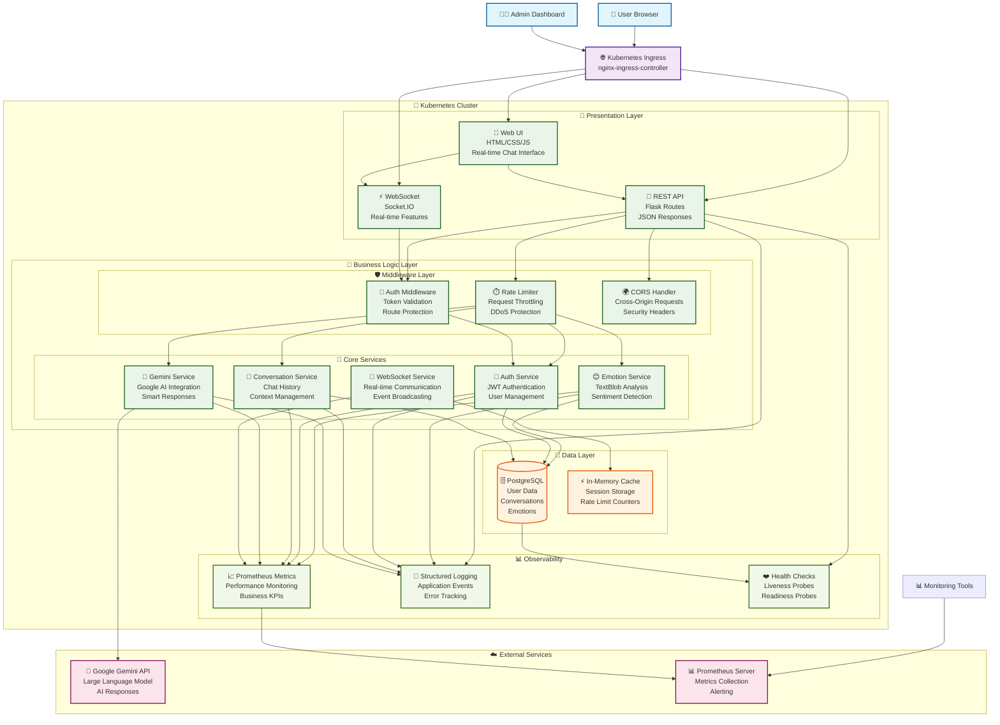
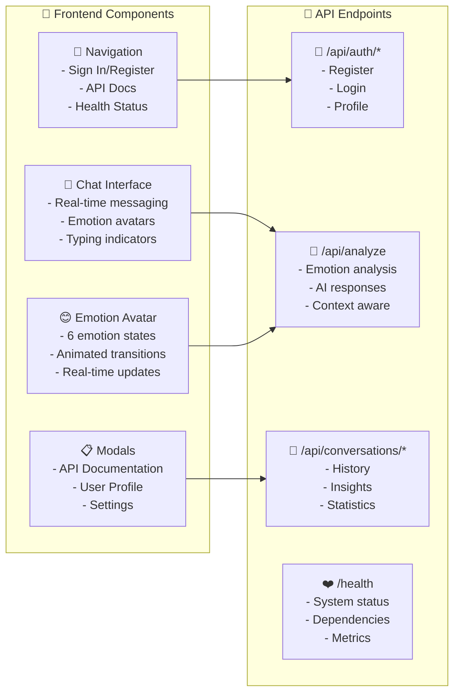
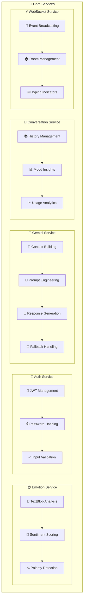
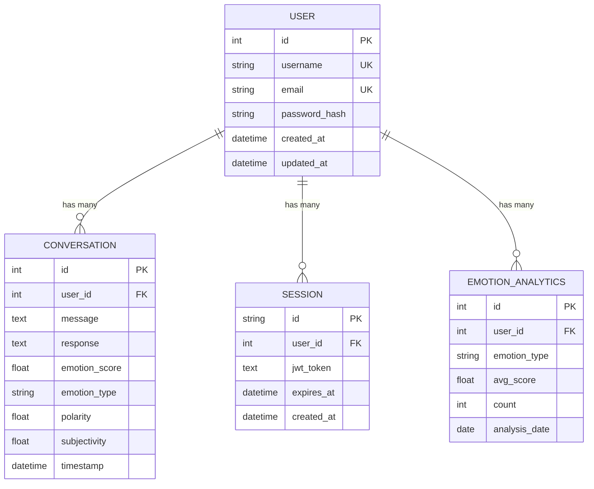
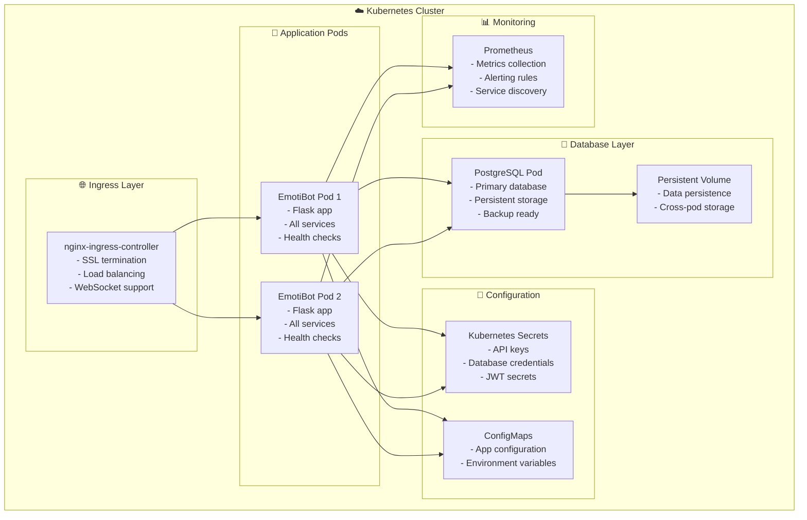
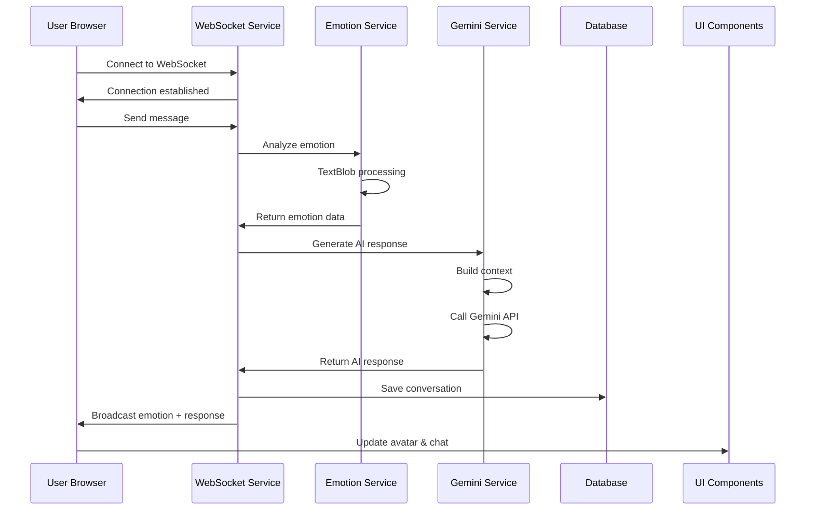
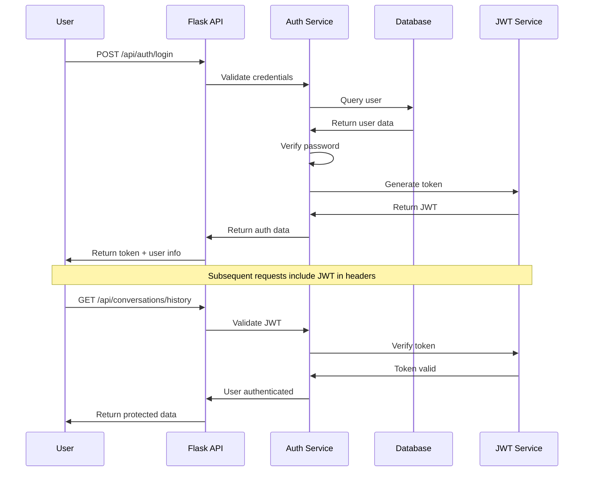
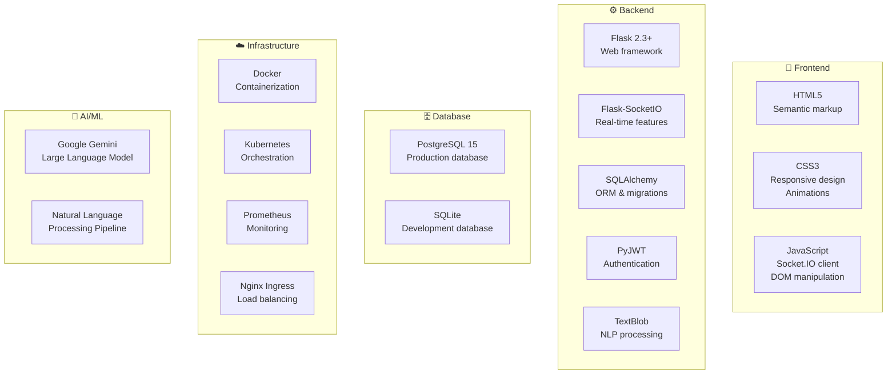
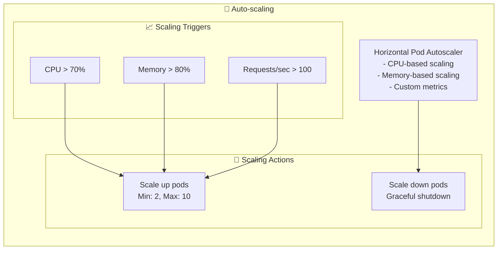
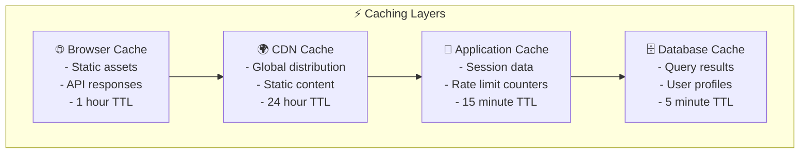

# 🏗️ EmotiBot Architecture Diagram

## System Overview

## Detailed Component Architecture

### 🎯 **Presentation Layer Components**

### 🧠 **Service Layer Architecture**

### 🗄️ **Data Architecture**

### 🐳 **Kubernetes Deployment Architecture**

## 🔄 **Data Flow Diagrams**

### Real-time Emotion Analysis Flow

### Authentication Flow

## 🏗️ **Technology Stack Overview**

## 📊 **Performance & Scalability**

### Horizontal Scaling Strategy

### Caching Strategy

This architecture diagram shows your EmotiBot application as a **modern, enterprise-grade system** with:

✅ **Microservices architecture** with clear separation of concerns
✅ **Cloud-native design** ready for Kubernetes deployment  
✅ **Real-time capabilities** with WebSocket integration
✅ **AI/ML integration** with Google Gemini
✅ **Enterprise security** with JWT authentication
✅ **Observability** with metrics, logging, and health checks
✅ **Scalability** with horizontal pod autoscaling
✅ **Data persistence** with PostgreSQL and proper data modeling

