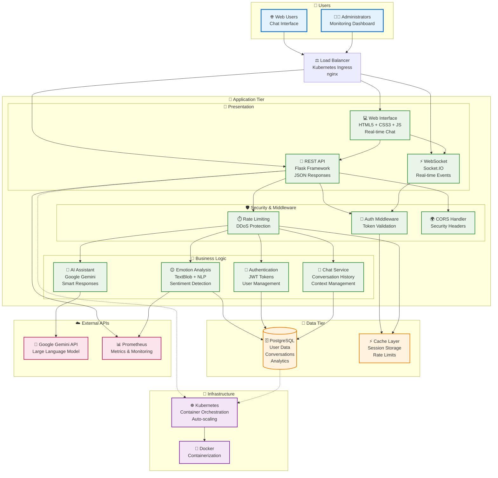
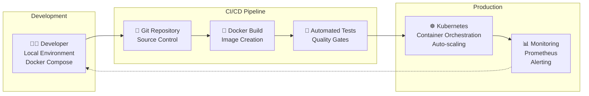

# 🎯 EmotiBot - Simplified Architecture Overview

## High-Level System Architecture



## 🏗️ Enterprise Architecture Layers

### 1. **Presentation Layer** 🎨
- **Modern Web Interface**: Responsive HTML5/CSS3/JavaScript
- **RESTful API**: Clean JSON-based communication
- **Real-time Features**: WebSocket for live chat and emotions
- **Progressive Enhancement**: Works without JavaScript

### 2. **Business Logic Layer** 🧠
- **Microservices Architecture**: Independent, scalable services
- **Domain-Driven Design**: Clear service boundaries
- **AI Integration**: Google Gemini for intelligent responses
- **Emotion Analysis**: NLP-powered sentiment detection

### 3. **Data Access Layer** 💾
- **ORM Pattern**: SQLAlchemy for database abstraction
- **Multi-database Support**: PostgreSQL (prod) + SQLite (dev)
- **Caching Strategy**: In-memory cache for performance
- **Data Persistence**: Kubernetes persistent volumes

### 4. **Security Layer** 🛡️
- **Authentication**: JWT token-based security
- **Authorization**: Role-based access control
- **Rate Limiting**: DDoS protection and fair usage
- **Input Validation**: Secure data handling

### 5. **Infrastructure Layer** 🐳
- **Containerization**: Docker for consistent deployments
- **Orchestration**: Kubernetes for scaling and management
- **Monitoring**: Prometheus metrics and health checks
- **Load Balancing**: High availability and performance

## 🔄 Key Data Flows

### Real-time Chat Flow
```
User Input → WebSocket → Emotion Analysis → AI Response → Database → UI Update
```

### Authentication Flow
```
Login Request → JWT Generation → Token Validation → Protected Resource Access
```

### Monitoring Flow
```
Application Metrics → Prometheus → Alerting → Dashboard Visualization
```

## 📊 Technology Stack Summary

| Layer | Technologies |
|-------|-------------|
| **Frontend** | HTML5, CSS3, JavaScript, Socket.IO |
| **Backend** | Python, Flask, Flask-SocketIO |
| **Database** | PostgreSQL, SQLAlchemy ORM |
| **AI/ML** | Google Gemini API, TextBlob NLP |
| **Security** | JWT, bcrypt, CORS, Rate Limiting |
| **Infrastructure** | Docker, Kubernetes, nginx |
| **Monitoring** | Prometheus, Health Checks |
| **Development** | Git, pytest, Docker Compose |

## 🎯 Enterprise Benefits

### **Scalability** 📈
- Horizontal pod autoscaling
- Stateless application design
- Database connection pooling
- Microservices architecture

### **Reliability** 🔒
- Health checks and probes
- Graceful error handling
- Circuit breaker patterns
- Data backup strategies

### **Security** 🛡️
- JWT authentication
- Rate limiting protection
- Input validation
- Secure secret management

### **Maintainability** 🔧
- Clean code architecture
- Separation of concerns
- Comprehensive testing
- Documentation standards

### **Observability** 👁️
- Prometheus metrics
- Structured logging
- Performance monitoring
- Real-time dashboards

## 🚀 Deployment Architecture


